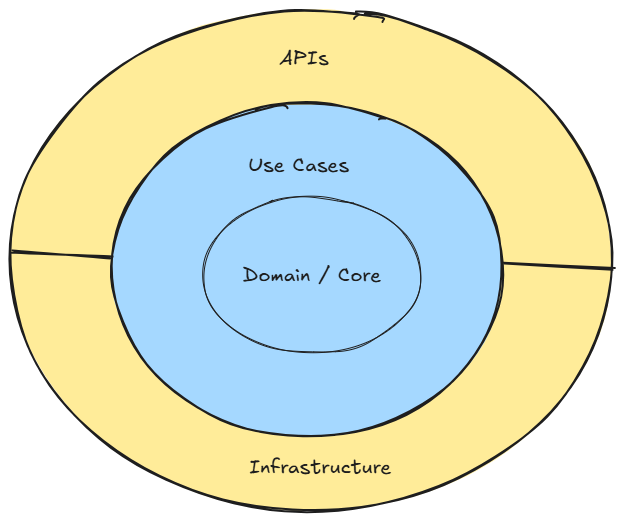

# Hackathon-Fiap

This project is using a clean archtecture based on Domain Driven Design fundamentals. 

Each project has its own README file to facilitate understanding of the solution.

- [Core Project](src/Hackathon.Fiap.Core/README.md)
- [Use Cases](src/Hackathon.Fiap.UseCases/README.md)
- [Infrastructure](src/Hackathon.Fiap.Infrastructure/README.md)
- [Doctor's API](src/Hackathon.Fiap.Api.Doctors/README.md)
- [Patient's API](src/Hackathon.Fiap.Api.Patients/README.md)

We also decided to use Aspire as our orchestrator, therefore we have additional two projects `Hackathon.Fial.AspireHost` and `Hackathon.Fial.ServiceDefaults`
These projects are included by default when we add the orchestration.

 - [Aspire Host](src/Hackathon.Fiap.AspireHost/README.md)
 - [Service Defaults](src/Hackathon.Fiap.ServiceDefaults/README.md)


## High-Level Architecture



## Setup

To run the application make sure the project `Hackathon.Fiap.AspireHost` is your startup project.

Set the user secrets for the AspireHost project:

```
cd src/Hackathon.Fiap.AspireHost/

dotnet user-secrets set Parameters:sql-password <yourSecretPassword>
```

## Migrations

To create the migrations, run the following script: `addMigration.ps1` on powershell and inform the migration name.