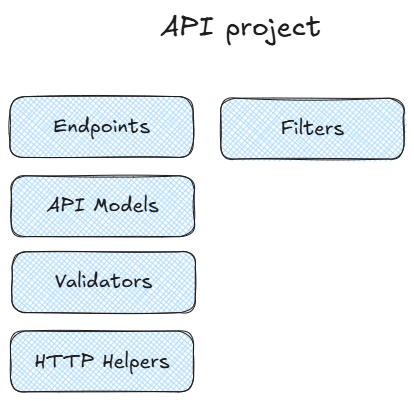

# Patient's API

Here are the enpdoints dedicated to the Patients.

You will find the following functionalities:

 - Registration 
    - register a new patient as a user for the system
 - Authentication 
    - authenticate with the patient using their Email or CPF and Password
 - List of available specialties
    - Will give the patient all the available options to choose
 - List doctors by specialty
    - Will list all doctors registered with that specialty
 - List doctor's available periods
    - Will list the available periods of a given doctor in a specific day
 - Create appointment
    - Will create a new appointment for a doctor in one available spot
 - Cancel appointment
    - Allows the patient to cancel one of their appointments

## High-Level

Here is a high level of what we can find in the API project

