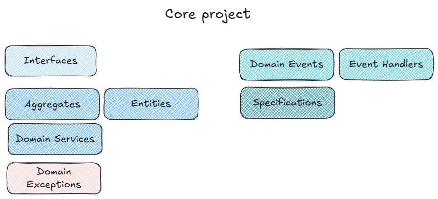

## Core (Domain Model) Project

The Core project is the center of the Clean Architecture design, and all other project dependencies should point toward it. As such, it has very few external dependencies. The Core project should include the Domain Model including things like:

- Entities
- Aggregates
- Value Objects
- Domain Events
- Domain Event Handlers
- Domain Services
- Specifications
- Interfaces

## High-Level

