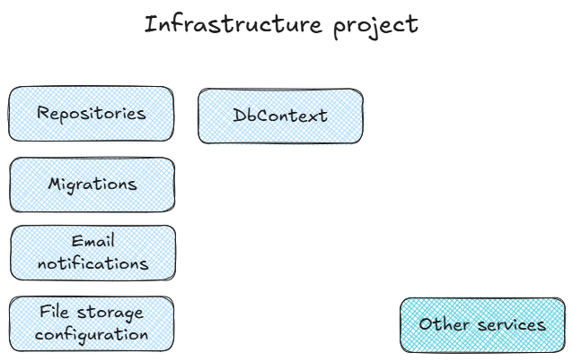

## Infrastructure Project

In Clean Architecture, Infrastructure concerns are kept separate from the core business rules (or domain model in DDD).

The only project that should have code concerned with EF, Files, Email, Web Services, Azure/AWS/GCP, etc is Infrastructure.

Infrastructure should depend on Core (and, optionally, Use Cases) where abstractions (interfaces) exist.

## High-Level

