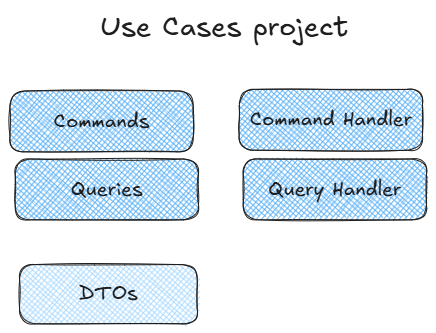

## Use Cases Project

In Clean Architecture, the Use Cases (or Application Services) project is a layer that wraps the domain model.

Use Cases are organized by feature. These may be simple CRUD operations or more complex activities.

Use Cases should only depends on Core layer, making use of abstractions to access data, making them simple to unit test in most cases.

Use Cases are often grouped into Commands and Queries, following CQRS.

## High-Level

